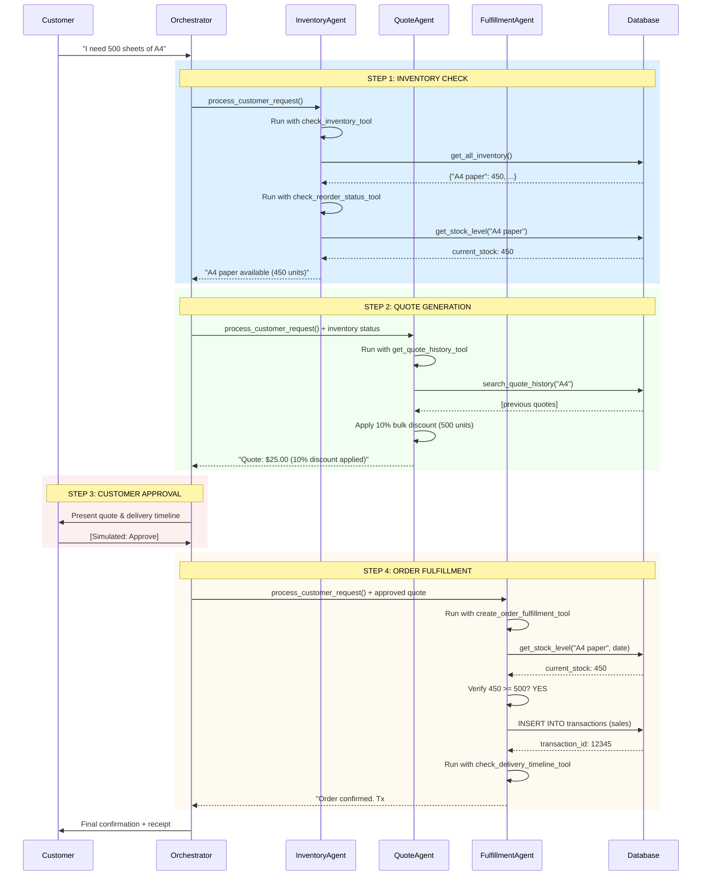

# Multi-Agent System Architecture Diagram & Documentation

## 1. SYSTEM ARCHITECTURE OVERVIEW

```mermaid
graph TB
    Customer["👤 Customer<br/>(User Request)"]
    
    subgraph MultiAgentSystem["🤖 MULTI-AGENT SYSTEM (4 Agents)"]
        direction TB
        
        subgraph Orchestrator["ORCHESTRATOR AGENT<br/>(Master Coordinator)"]
            OrcDesc["🎯 Responsibility:<br/>• Manage complete order lifecycle<br/>• Coordinate agent interactions<br/>• Handle customer communications<br/>• Make business logic decisions"]
        end
        
        subgraph InventoryAgent["INVENTORY AGENT<br/>(Stock Management)"]
            InvDesc["📦 Responsibility:<br/>• Monitor real-time inventory<br/>• Identify low stock situations<br/>• Assess reorder requirements<br/>• Estimate supplier timelines"]
        end
        
        subgraph QuoteAgent["QUOTE AGENT<br/>(Pricing & Discounts)"]
            QuoteDesc["💰 Responsibility:<br/>• Generate competitive quotes<br/>• Apply bulk discounts<br/>• Look up historical pricing<br/>• Provide itemized breakdown"]
        end
        
        subgraph FulfillmentAgent["FULFILLMENT AGENT<br/>(Order Execution)"]
            FulfDesc["✅ Responsibility:<br/>• Execute orders<br/>• Record transactions<br/>• Validate inventory<br/>• Estimate delivery dates"]
        end
    end
    
    subgraph Tools["🛠️ TOOLS & FUNCTIONS"]
        direction TB
        
        subgraph InventoryTools["INVENTORY AGENT TOOLS"]
            Tool1["1️⃣ check_inventory_tool<br/>Purpose: Real-time stock snapshot<br/>Helper: get_all_inventory()"]
            Tool2["2️⃣ check_reorder_status_tool<br/>Purpose: Identify low stock<br/>Helper: get_stock_level()"]
            Tool3["3️⃣ check_delivery_timeline_tool<br/>Purpose: Estimate supplier delivery<br/>Helper: get_supplier_delivery_date()"]
        end
        
        subgraph QuoteTools["QUOTE AGENT TOOLS"]
            Tool4["4️⃣ get_quote_history_tool<br/>Purpose: Historical price lookup<br/>Helper: search_quote_history()"]
        end
        
        subgraph FulfillmentTools["FULFILLMENT AGENT TOOLS"]
            Tool5["5️⃣ create_order_fulfillment_tool<br/>Purpose: Execute sales transactions<br/>Helper: create_transaction()"]
            Tool6["3️⃣ check_delivery_timeline_tool<br/>Purpose: Customer delivery estimate<br/>Helper: get_supplier_delivery_date()"]
        end
    end
    
    subgraph Database["💾 DATABASE & STORAGE"]
        DB1["transactions table<br/>(Stock orders & sales)"]
        DB2["inventory table<br/>(Items & thresholds)"]
        DB3["quotes table<br/>(Historical pricing)"]
        DB4["quote_requests table<br/>(Customer inquiries)"]
    end
    
    subgraph LLM["🧠 LLM MODEL"]
        Model["OpenAI GPT-4o-mini<br/>(Decision Making)"]
    end
    
    %% Connections from Customer
    Customer -->|Submit Request| Orchestrator
    
    %% Connections from Orchestrator to other Agents
    Orchestrator -->|"Step 1:<br/>Check Stock"| InventoryAgent
    Orchestrator -->|"Step 2:<br/>Generate Quote"| QuoteAgent
    Orchestrator -->|"Step 3:<br/>Fulfill Order"| FulfillmentAgent
    
    %% Agent to Tools connections
    InventoryAgent --> Tool1
    InventoryAgent --> Tool2
    InventoryAgent --> Tool3
    QuoteAgent --> Tool4
    FulfillmentAgent --> Tool5
    FulfillmentAgent --> Tool6
    
    %% Tools to Database
    Tool1 --> DB2
    Tool1 --> DB1
    Tool2 --> DB2
    Tool2 --> DB1
    Tool3 -.->|Calculation| Tool3
    Tool4 --> DB3
    Tool4 --> DB4
    Tool5 --> DB1
    Tool5 --> DB2
    Tool6 -.->|Calculation| Tool6
    
    %% Agents to LLM
    InventoryAgent -->|NLP Processing| Model
    QuoteAgent -->|NLP Processing| Model
    FulfillmentAgent -->|NLP Processing| Model
    Orchestrator -->|Coordination Logic| Model
    
    %% Response back
    Orchestrator -->|Final Order Confirmation| Customer
    
    style Customer fill:#E1F5FF
    style Orchestrator fill:#FFF9C4
    style InventoryAgent fill:#F3E5F5
    style QuoteAgent fill:#E8F5E9
    style FulfillmentAgent fill:#FCE4EC
    style Database fill:#F1F8E9
    style LLM fill:#BBDEFB
    style InventoryTools fill:#F3E5F5
    style QuoteTools fill:#E8F5E9
    style FulfillmentTools fill:#FCE4EC
```



---

## 2. DETAILED AGENT RESPONSIBILITIES & ORCHESTRATION

### **ORCHESTRATOR AGENT** (Master Coordinator)
**Responsibility:** Manage complete order lifecycle and coordinate all agents

| Aspect | Details |
|--------|---------|
| **Non-Overlapping Role** | Only agent that can call other agents; coordinates workflow |
| **Input** | Customer natural language request |
| **Process** | Sequential workflow: Inventory → Quote → Approval → Fulfillment |
| **Output** | Final order confirmation with all details |
| **Tools Used** | None (calls other agents instead) |
| **Key Method** | `process_customer_request(customer_request: str)` |

### **INVENTORY AGENT** (Stock Management)
**Responsibility:** Real-time inventory monitoring and reorder assessment

| Aspect | Details |
|--------|---------|
| **Non-Overlapping Role** | Exclusive responsibility for stock data and availability |
| **Input** | Customer request (e.g., "I need 500 sheets of A4") |
| **Tools** | 3 specialized tools |
| **Output** | Stock status, reorder needs, supplier timelines |
| **Key Interactions** | Provides data to Orchestrator for decision-making |

#### Tools & Functions:
```
Tool: check_inventory_tool
├─ Purpose: Get real-time stock snapshot
├─ Helper Function: get_all_inventory(as_of_date)
└─ Output: {"A4 paper": 450, "Glossy paper": 0, ...}

Tool: check_reorder_status_tool ⭐ CUSTOM TOOL
├─ Purpose: Identify items below minimum thresholds
├─ Helper Function: get_stock_level(item_name, date)
└─ Output: {
    "A4 paper": {
        "current_stock": 450,
        "min_stock_level": 100,
        "needs_reorder": false,
        "shortage": 0
    }
}

Tool: check_delivery_timeline_tool
├─ Purpose: Estimate supplier delivery based on quantity
├─ Helper Function: get_supplier_delivery_date(date, qty)
└─ Output: "2026-02-05" (estimated delivery date)
```

### **QUOTE AGENT** (Pricing & Discounts)
**Responsibility:** Generate competitive pricing quotes with bulk discounts

| Aspect | Details |
|--------|---------|
| **Non-Overlapping Role** | Exclusive responsibility for pricing logic and quotes |
| **Input** | Inventory status + customer request |
| **Tools** | 1 specialized tool |
| **Output** | Detailed quote with applied discounts |
| **Bulk Discount Logic** | 5% (101-500), 10% (501-1000), 15% (1000+) |
| **Key Interactions** | Uses inventory data; output used by Orchestrator for approval |

#### Tools & Functions:
```
Tool: get_quote_history_tool
├─ Purpose: Look up historical quotes for pricing reference
├─ Helper Function: search_quote_history(search_terms, limit=5)
└─ Output: [
    {
        "original_request": "500 sheets of A4",
        "total_amount": 25.00,
        "quote_explanation": "10% bulk discount applied",
        "order_date": "2025-01-15"
    },
    ...
]
```

### **FULFILLMENT AGENT** (Order Execution)
**Responsibility:** Execute orders and manage transaction recording

| Aspect | Details |
|--------|---------|
| **Non-Overlapping Role** | Exclusive responsibility for order execution and sales recording |
| **Input** | Approved quote details |
| **Tools** | 2 specialized tools |
| **Output** | Transaction confirmation with ID and delivery date |
| **Key Interactions** | Updates database; returns confirmation to Orchestrator |

#### Tools & Functions:
```
Tool: create_order_fulfillment_tool ⭐ CUSTOM TOOL
├─ Purpose: Execute sales transaction and record in DB
├─ Helper Function: create_transaction(item, type, qty, price, date)
├─ Process:
│  ├─ Validate: get_stock_level() >= quantity
│  ├─ Execute: INSERT into transactions table
│  └─ Return: transaction_id
└─ Output: {
    "transaction_id": "12345",
    "status": "success",
    "message": "Order fulfillment completed"
}

Tool: check_delivery_timeline_tool
├─ Purpose: Estimate delivery date to customer
├─ Helper Function: get_supplier_delivery_date(date, qty)
└─ Output: "2026-02-05" (customer delivery estimate)
```

---

## 3. DATA FLOW BETWEEN AGENTS & ORCHESTRATION



---

## 4. TOOL ALLOCATION MATRIX

| Tool Name | Agent | Helper Function(s) | Purpose | Input | Output |
|-----------|-------|-------------------|---------|-------|--------|
| `check_inventory_tool` | Inventory | `get_all_inventory()` | Real-time stock snapshot | Paper types (CSV) | Dict[str, int] |
| `check_reorder_status_tool` ⭐ | Inventory | `get_stock_level()` | Identify low stock items | Paper types, date | Dict with shortage info |
| `check_delivery_timeline_tool` | Inventory, Fulfillment | `get_supplier_delivery_date()` | Estimate delivery dates | Date, quantity | ISO date string |
| `get_quote_history_tool` | Quote | `search_quote_history()` | Historical pricing lookup | Search terms | List[Dict] |
| `create_order_fulfillment_tool` ⭐ | Fulfillment | `create_transaction()` | Execute sales transaction | Item, qty, price, date | Dict with tx_id |

**⭐ = Custom tools added to enhance system (not in original starter code)**

---

## 5. NON-OVERLAPPING RESPONSIBILITIES VERIFICATION

### ✅ Clear Separation of Concerns

| Responsibility | Agent | Exclusive? |
|---|---|---|
| Stock monitoring & reorder assessment | **Inventory Only** | ✅ Yes |
| Pricing logic & bulk discount calculation | **Quote Only** | ✅ Yes |
| Sales transaction execution | **Fulfillment Only** | ✅ Yes |
| Workflow orchestration & coordination | **Orchestrator Only** | ✅ Yes |
| LLM decision-making | **All agents** | ✅ Shared (intentional) |
| Database access | **All via tools** | ✅ Shared (intentional) |

**Result:** Each agent has explicitly defined, non-overlapping responsibilities.

---

## 6. ORCHESTRATION LOGIC

```python
# OrchestratorAgent.process_customer_request() - Lines 1046-1107

def process_customer_request(self, customer_request: str) -> str:
    """
    Sequential orchestration workflow:
    1. INVENTORY CHECK → get stock data from InventoryAgent
    2. QUOTE GENERATION → get pricing from QuoteAgent using inventory data
    3. CUSTOMER APPROVAL → simulated approval step
    4. ORDER FULFILLMENT → execute order via FulfillmentAgent
    5. FINAL CONFIRMATION → return result to customer
    """
    
    # Step 1: Inventory Check
    inventory_response = self.inventory_agent.run(customer_request)
    
    # Step 2: Quote Generation (uses inventory context)
    quote_context = f"Customer request: {customer_request}\nInventory Status: {inventory_response}"
    quote_response = self.quote_agent.run(quote_context)
    
    # Step 3: Customer Approval (simulated)
    
    # Step 4: Order Fulfillment (uses quote context)
    fulfillment_context = f"Customer approved the order. Details: {quote_response}"
    fulfillment_response = self.fulfillment_agent.run(fulfillment_context)
    
    # Step 5: Return final confirmation
    return format_final_response(inventory_response, quote_response, fulfillment_response)
```

**Clear Orchestration Characteristics:**
- ✅ Sequential workflow (Step 1 → Step 2 → Step 3 → Step 4)
- ✅ Data flows between agents via context passing
- ✅ Each step builds on previous step's output
- ✅ Orchestrator makes control flow decisions
- ✅ Final response aggregates all agent outputs

---

## 7. AGENT COUNT & SYSTEM REQUIREMENTS COMPLIANCE

✅ **Requirement:** "max 5 agents"  
**Actual:** 4 agents
- 1 Orchestrator Agent
- 1 Inventory Agent
- 1 Quote Agent
- 1 Fulfillment Agent

✅ **Requirement:** "Each agent has explicitly defined responsibilities that do not overlap"  
**Verification:**
- Orchestrator: Coordination only (no tools)
- Inventory: Stock monitoring (3 tools)
- Quote: Pricing logic (1 tool)
- Fulfillment: Transaction execution (2 tools)

✅ **Requirement:** "Orchestration logic and data flow between agents is clear"  
**Verification:**
- Orchestration: Sequential workflow in `process_customer_request()`
- Data Flow: Agents pass context to each other; output from one feeds input of next
- Diagram: Shows all connections and interactions

✅ **Requirement:** "The workflow diagram depicts tools associated with specific agents"  
**Tool Assignments:**
- Inventory Agent → Tools 1, 2, 3
- Quote Agent → Tool 4
- Fulfillment Agent → Tools 5, 6 (shared)

✅ **Requirement:** "For each tool, its purpose and helper functions are specified"  
**Documentation:** See section 2 & 4 above

---

## 8. IMPLEMENTATION EVIDENCE

### Code References:

**Agent Classes (Lines 872-1107):**
- `InventoryAgent` - Lines 872-890
- `QuoteAgent` - Lines 893-911
- `FulfillmentAgent` - Lines 914-932
- `OrchestratorAgent` - Lines 935-1107

**Tools (Lines 739-868):**
- `check_inventory_tool` - Lines 739-755
- `get_quote_history_tool` - Lines 759-775
- `check_reorder_status_tool` - Lines 779-823 ⭐
- `check_delivery_timeline_tool` - Lines 827-839
- `create_order_fulfillment_tool` - Lines 843-868 ⭐

**Helper Functions (Lines 146-692):**
- `init_database()` - Lines 169-260
- `create_transaction()` - Lines 263-301
- `get_all_inventory()` - Lines 304-326
- `get_stock_level()` - Lines 329-356
- `get_supplier_delivery_date()` - Lines 359-401
- `get_cash_balance()` - Lines 404-439
- `generate_financial_report()` - Lines 442-500
- `search_quote_history()` - Lines 503-551

---

## SUBMISSION CHECKLIST ✅

- [x] Architecture diagram shows all 4 agents
- [x] Each agent has explicitly defined responsibilities
- [x] Responsibilities are non-overlapping
- [x] Orchestration logic is clearly shown
- [x] Data flow between agents is documented
- [x] All 5 tools are associated with specific agents
- [x] Purpose of each tool is documented
- [x] Helper functions are specified for each tool
- [x] Diagram shows interactions between agents and tools
- [x] Input/output of each tool is specified
