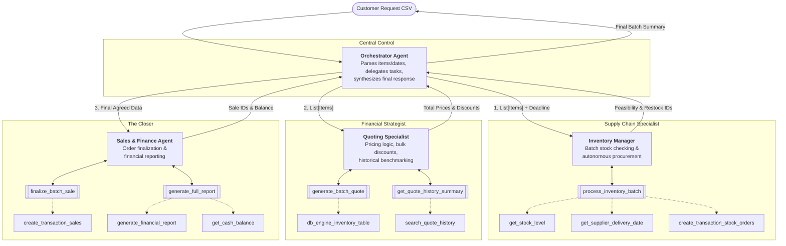

# Munder Difflin Multi-Agent System Project

This repository contains a fully implemented **Munder Difflin Paper Company Multi-Agent System** that automates core business operations at a fictional paper manufacturing company using modern AI agents and Python frameworks.

## Project Context

You’ve been hired as an AI consultant by Munder Difflin Paper Company, a fictional enterprise looking to modernize their workflows. They need a smart, modular **multi-agent system** to automate:

- **Inventory checks** and restocking decisions
- **Quote generation** for incoming sales inquiries
- **Order fulfillment** including supplier logistics and transactions

Your solution must use a maximum of **5 agents** and process inputs and outputs entirely via **text-based communication**.

This project challenges your ability to orchestrate agents using modern Python frameworks like `smolagents`, `pydantic-ai`, or `npcsh`, and combine that with real data tools like `sqlite3`, `pandas`, and LLM prompt engineering.

---

## What's Included

This project includes:

- **Multi-Agent System:** A coordinated system of 5 specialized agents (`main.py`)
  - `InventoryManagerAgent`: Manages inventory levels and restocking decisions
  - `QuoteAgent`: Generates quotes for incoming sales inquiries
  - `CustomerAgent`: Handles customer interactions
  - `FulfillmentAgent`: Processes order fulfillment and logistics
  - `OrchestratorAgent`: Coordinates all agents and orchestrates workflows

- **Data Files:**
  - `quotes.csv`: Historical quote data for reference
  - `quote_requests.csv`: Complete customer request dataset
  - `quote_requests_sample.csv`: Simulated test cases
  - `paper_supplies.json`: Product inventory database

- **Database Tools:** SQLite integration for persistent state management
- **Utilities:** Financial reporting, transaction logging, and analysis tools
- **Test Results:** `test_results.csv` with complete interaction logs and outcomes

---

## Workspace Instructions

All files are provided in this repository. The project uses the `smolagents` framework for agent orchestration with OpenAI-compatible APIs.

## Local Setup Instructions

### 1. Install Python and UV Package Manager

Make sure you have Python 3.8+ installed. We recommend using **UV** as the package manager for faster and more reliable dependency management.

**Install UV:**
- **macOS/Linux:** `curl -LsSf https://astral.sh/uv/install.sh | sh`
- **Windows:** `powershell -c "irm https://astral.sh/uv/install.ps1 | iex"`
- **Via pip:** `pip install uv`

### 2. Install Dependencies

Using UV (recommended):
```bash
uv sync
```

Or using pip:
```bash
pip install -r requirements.txt
```

If you're using smolagents, install it separately:
```bash
uv pip install smolagents
```

For other options like pydantic-ai or npcsh[lite], refer to their documentation.

### 3. Create and Configure .env File

Create a `.env` file in the project root directory with your environment variables:

```env
UDACITY_OPENAI_API_KEY=your_openai_key_here
SMOLAGENT_VERBOSITY=0
LOGGING_LEVEL=INFO
```

**Environment Variables:**
- `UDACITY_OPENAI_API_KEY`: Your OpenAI-compatible API key (required). This project uses a custom OpenAI-compatible proxy hosted at https://openai.vocareum.com/v1
- `SMOLAGENT_VERBOSITY`: Controls agent verbosity level (0-2, default: 0)
- `LOGGING_LEVEL`: Sets logging level (DEBUG, INFO, WARNING, ERROR, CRITICAL, default: INFO)

**Important:** Never commit the `.env` file to version control. Add it to `.gitignore`.

## How to Run the Project

To execute the multi-agent system and process customer requests:

1. Ensure all dependencies are installed (see "Local Setup Instructions")
2. Configure your `.env` file with the required API key
3. Run the main script:
   ```bash
   uv run main.py
   # or
   python main.py
   ```

The system will:
- Initialize the SQLite database (if not already present)
- Load sample customer requests from `quote_requests_sample.csv`
- Orchestrate agents to process each request
- Generate quotes, check inventory, and process fulfillment
- Output transaction logs and financial reports
- Save detailed results to `test_results.csv`

### Debugging Single Requests

To debug a specific request, modify the `request_num` variable in `main.py` (around line 118):

```python
# MANUAL DEBUG: Set request_num here to debug a specific request
request_num = 0  # Change this to any index you want to debug
```

Results will be appended to `test_results.csv` for tracking multiple debug runs.

---

## Project Architecture

The multi-agent system consists of five specialized agents working in coordination:

- **InventoryManagerAgent** (`mutil_agents/agents/inventory_management_v2.py`): Monitors stock levels and makes restocking decisions
- **QuoteAgent** (`mutil_agents/agents/quote_agent_v2.py`): Generates competitive quotes based on historical data
- **CustomerAgent** (`mutil_agents/agents/customer_agent.py`): Manages customer interactions and context
- **FulfillmentAgent** (`mutil_agents/agents/fulfillment_agent_v2.py`): Handles order processing and logistics
- **OrchestratorAgent** (`mutil_agents/agents/orchestrator_agent.py`): Coordinates workflows between agents

Supporting tools are located in `mutil_agents/tools/` with utilities for database management, inventory operations, quoting, fulfillment, and financial reporting.

### Workflow Diagram



## Output Files

- `munder_difflin.db`: SQLite database with inventory, transactions, and financial data
- `munder_difflin.log`: Detailed execution logs for debugging and analysis
- `test_results.csv`: Results from test runs including request details, fulfillment status, and financial impact