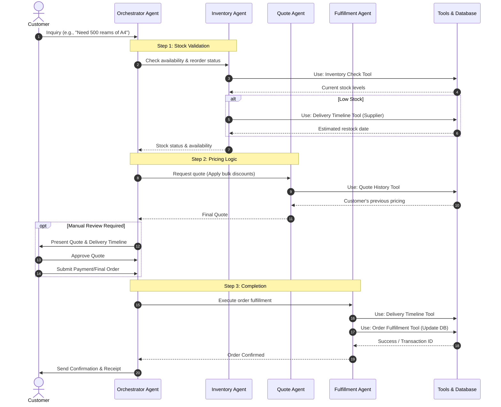

```mermaid
sequenceDiagram
    autonumber
    actor Customer
    participant Orch as Orchestrator Agent
    participant Inv as Inventory Agent
    participant Quote as Quote Agent
    participant Full as Fulfillment Agent
    participant DB as Tools & Database

    Customer->>Orch: Inquiry (e.g., "Need 500 reams of A4")
    
    Note over Orch, Inv: Step 1: Stock Validation
    Orch->>Inv: Check availability & reorder status
    Inv->>DB: Use: Inventory Check Tool
    DB-->>Inv: Current stock levels
    alt Low Stock
        Inv->>DB: Use: Delivery Timeline Tool (Supplier)
        DB-->>Inv: Estimated restock date
    end
    Inv-->>Orch: Stock status & availability

    Note over Orch, Quote: Step 2: Pricing Logic
    Orch->>Quote: Request quote (Apply bulk discounts)
    Quote->>DB: Use: Quote History Tool
    DB-->>Quote: Customer's previous pricing
    Quote-->>Orch: Final Quote

    ### New Optional Step ###
    opt Manual Review Required
        Orch->>Customer: Present Quote & Delivery Timeline
        Customer->>Orch: Approve Quote
        Customer->>Orch: Submit Payment/Final Order
    end

    

    Note over Orch, Full: Step 3: Completion
    Orch->>Full: Execute order fulfillment
    Full->>DB: Use: Delivery Timeline Tool
    Full->>DB: Use: Order Fulfillment Tool (Update DB)
    DB-->>Full: Success / Transaction ID
    Full-->>Orch: Order Confirmed

    Orch->>Customer: Send Confirmation & Receipt
```